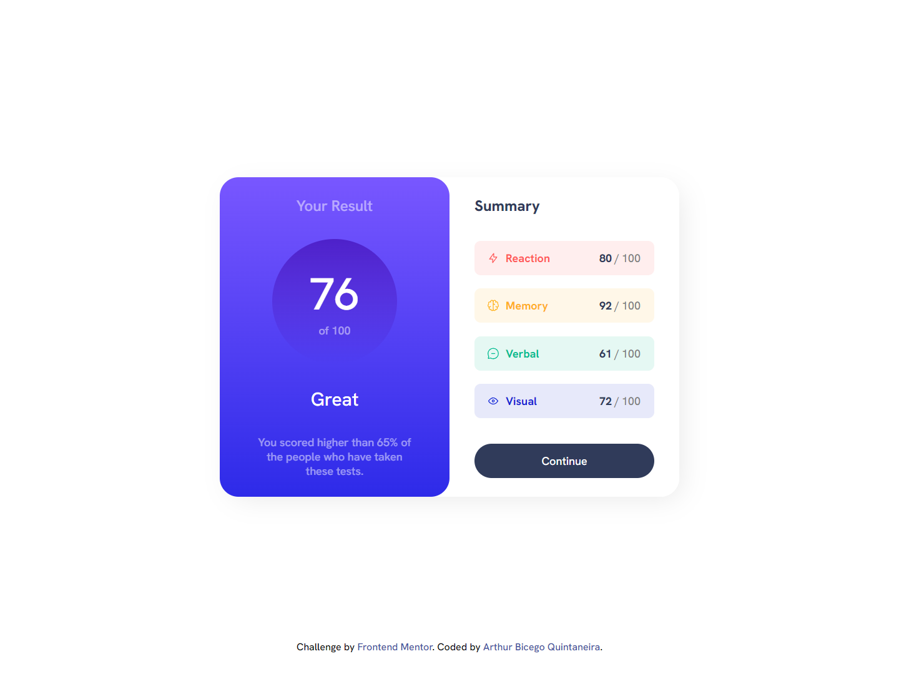

# Frontend Mentor - Results summary component solution

This is a solution to the [Results summary component challenge on Frontend Mentor](https://www.frontendmentor.io/challenges/results-summary-component-CE_K6s0maV). Frontend Mentor challenges help you improve your coding skills by building realistic projects.

## Table of contents

- [Overview](#overview)
  - [The challenge](#the-challenge)
  - [Screenshots](#screenshots)
  - [Links](#links)
- [My process](#my-process)
  - [Built with](#built-with)
  - [What I learned](#what-i-learned)
  - [Continued development](#continued-development)
  - [Useful resources](#useful-resources)
- [Author](#author)
- [Acknowledgments](#acknowledgments)

## Overview

### The challenge

Users should be able to:

- View the optimal layout for the interface depending on their device's screen size
- See hover and focus states for all interactive elements on the page
- **Bonus**: Use the local JSON data to dynamically populate the content

### Screenshots

Challenge screenshot:


Result screenshot:



### Links

- Solution: [Frontend Mentor](https://www.frontendmentor.io/solutions/results-summary-components-a-responsive-css-project-pZMvh6x-U7)
- Live Site: [Github Pages](https://arthurbicego.github.io/frontend-mentor-1/)

## My process

### Built with

- HTML5
- CSS3
- Flexbox

### What I learned

Some of my major learnings in this challenge was with CSS, such as: code optimization and class reusing, Flexbox centering properties, and avoid magic numbers.

Flexbox Centering Property:

```css
main {
  width: 100%;
  height: 100vh;
  display: flex;
  justify-content: center;
  align-items: center;
}
```

### Continued development

In this challenge the main skills I identified that I need to improve is understand better the behavior of nested div and the Flexbox.

### Useful resources

- [Youtube - CSS Full Course for Beginners](https://www.youtube.com/watch?v=n4R2E7O-Ngo&list=PL0Zuz27SZ-6Mx9fd9elt80G1bPcySmWit&index=27) - This is a Complete CSS Tutorial video which helped me to review some CSS concepts.
- [CSS-TRICKS - A Complete Guide to Flexbox](https://css-tricks.com/snippets/css/a-guide-to-flexbox/) - This article helped me to understand how Flexbox works.

## Author

- Linkedin - [Arthur Bicego Quintaneira](https://www.linkedin.com/in/arthurbicego/)
- Github - [@arthurbicego](https://github.com/arthurbicego)
- Frontend Mentor - [@arthurbicego](https://www.frontendmentor.io/profile/arthurbicego)

## Acknowledgments

A special thanks to [Victor Bicego Quintaneira](https://www.linkedin.com/in/victorbicego/) and [Giovana Yokota](https://www.linkedin.com/in/gyokota/) who ever encourage me to study programming and from whom I was introduced to [Frontend Mentor](https://www.frontendmentor.io/) platform.
